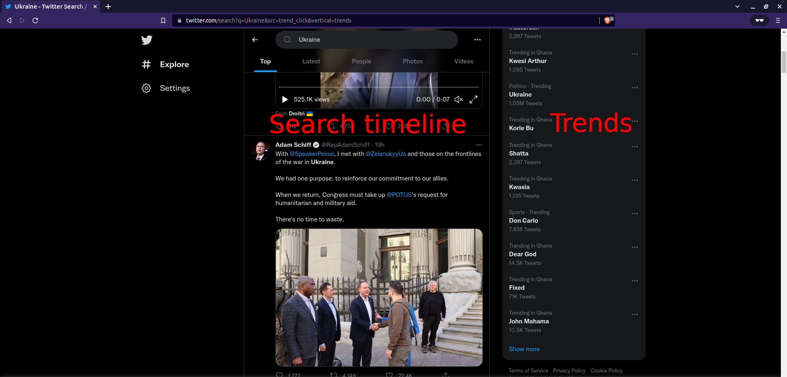
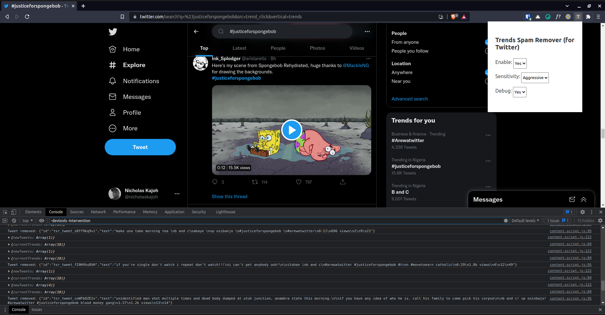
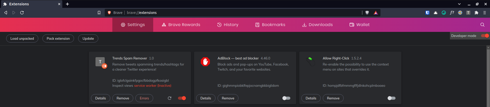

# Trends Spam Remover [WIP]
A Chrome extension for hiding tweets in the search timeline that spam trends (i.e using multiple trending hashtags/keywords in tweets in order to gain more views). It basically looks at the trends in the right sidebar and hides tweets in the timeline that use several of them based on a configured threshold.

## Installation
> NB: This extension is currently in development so it's not available in the Chrome Web Store.

- Clone this repo.
- Go to `chrome://extentions` in your browser.
- Enable developer mode.
- Click "Load unpacked" and select the cloned repo.
